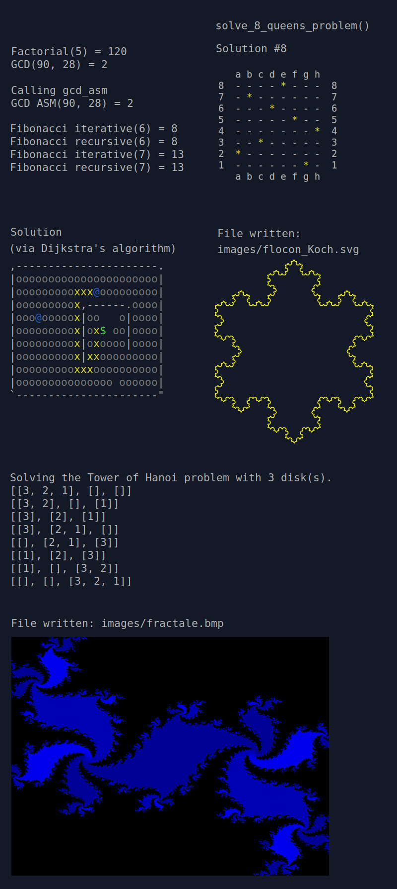

## (French below)

# algorithmes-en-rust (English)

Here's a collection of common algorithms implemented in Rust, to give you an idea of the language. Can also be used to prepare courses.



## Download / use

No external dependencies, other than rust itself (see: https://www.rust-lang.org/fr/tools/install).

```bash
# Alternative to git: $ wget https://github.com/v-espitalier/algorithmes-en-rust/archive/refs/heads/main.zip
git clone https://github.com/v-espitalier/algorithmes-en-rust
cd algorithmes-en-rust
cargo run
```


## Initiation algorithms:

* factorial (recursive)
https://en.wikipedia.org/wiki/Factorial

* fibonacci (iterative and recursive)
https://en.wikipedia.org/wiki/Fibonacci_sequence

* linear search
https://en.wikipedia.org/wiki/Linear_search

* Binary search (recursive)
https://en.wikipedia.org/wiki/Binary_search_algorithm

* pgcd (recursive in Rust and iterative in assembly)
https://en.wikipedia.org/wiki/Greatest_common_divisor

## Sorting algorithms:

* insertion sort
https://en.wikipedia.org/wiki/Insertion_sort

* selection sort
https://en.wikipedia.org/wiki/Selection_sort

* quick sort
https://en.wikipedia.org/wiki/Quicksort

* merge sort
https://en.wikipedia.org/wiki/Merge_sort

* heap sort
https://en.wikipedia.org/wiki/Heapsort

(Two implementations are sometimes proposed, the variant of which is generic and uses Rust features, so that different codes can be compared and a simpler implementation that sorts integers only is available).

## Algorithms associated with probability or partial randomization

* MINSTD random generator aka 'minimum standard' (de Park and Miller, 1988)

https://en.wikipedia.org/wiki/Linear_congruential_generator

https://en.wikipedia.org/wiki/Lehmer_random_number_generator

* Fisher Yates random permutation
https://en.wikipedia.org/wiki/Fisher%E2%80%93Yates_shuffle

* Box-Muller method for generating normal laws
https://en.wikipedia.org/wiki/Box%E2%80%93Muller_transform

* Calculation of table mean and variance with Rust features

## Miscellaneous algorithms

* Solving the 8 queens puzzle
https://en.wikipedia.org/wiki/Eight_queens_puzzle

* Searching for prime numbers using the trial division algorithm (with multithreading option)
https://en.wikipedia.org/wiki/Prime_number#Trial_division

## Rust language features tested:

* Generic trait-based functions: See [tri_variances.rs](https://github.com/v-espitalier/algorithmes-en-rust/blob/main/src/tri_variantes.rs)

* Creation of a new data type (rationals), and implementation of basic traits for arithmetics: See [rationals.rs](https://github.com/v-espitalier/algorithmes-en-rust/blob/main/src/rationnels.rs)

* Multithreading: See recherche_premiers_multithreading() in [divers.rs](https://github.com/v-espitalier/algorithmes-en-rust/blob/main/src/divers.rs#L421)

* Macro unit tests, a.k.a. regression tests: See [tests.rs](https://github.com/v-espitalier/algorithmes-en-rust/blob/main/src/tests.rs)

* Assembly code inserted in Rust: Cf pgcd_asm() in [divers.rs](https://github.com/v-espitalier/algorithmes-en-rust/blob/main/src/divers.rs#L349)

# Licence
Le code source de ce dépôt est publié sous license MIT.
Voir [LICENSE](https://github.com/v-espitalier/algorithmes-en-rust/blob/main/LICENSE) pour plus d'informations.

The source code of this repository is released under the MIT license.
See [LICENSE](https://github.com/v-espitalier/algorithmes-en-rust/blob/main/LICENSE) for more information.


</br>

</br>

# algorithmes-en-rust (French)

Voilà une recueil d'algorithmes courants, implémentés en langage Rust, pour se faire une idée du langage. Peut éventuellement servir pour préparer des cours.


## Téléchargement / utilisation

Pas de dépendances externes, autres que rust lui_même (voir: https://www.rust-lang.org/fr/tools/install).

```bash
# Alternative à git: $ wget https://github.com/v-espitalier/algorithmes-en-rust/archive/refs/heads/main.zip
git clone https://github.com/v-espitalier/algorithmes-en-rust
cd algorithmes-en-rust
cargo run
```


## Algorithmes classiques:

* factorielle (récursive)
https://fr.wikipedia.org/wiki/Factorielle

* fibonacci (itératif et récursif)
https://fr.wikipedia.org/wiki/Suite_de_Fibonacci

* recherche lineaire
https://fr.wikipedia.org/wiki/Recherche_s%C3%A9quentielle

* recherche dichotomique (récursif)
https://fr.wikipedia.org/wiki/Recherche_dichotomique

* pgcd (récursif en Rust et itératif en assembleur)
https://fr.wikipedia.org/wiki/Plus_grand_commun_diviseur

## Algorithmes de tri:

* tri par insertion
https://fr.wikipedia.org/wiki/Tri_par_insertion

* tri par selection
https://fr.wikipedia.org/wiki/Tri_par_s%C3%A9lection

* tri rapide
https://fr.wikipedia.org/wiki/Tri_rapide

* tri fusion
https://fr.wikipedia.org/wiki/Tri_fusion

* tri par tas
https://fr.wikipedia.org/wiki/Tri_par_tas

(Deux implémentations sont parfois proposées, dont la variante est générique et utilise les traits de Rust, afin de pouvoir comparer les différents codes et de disposer d'une implémentation plus simple qui trie uniquement les entiers.)

## Algorithmes associés aux probabilités ou partiellement aléatoires

* Générateur aléatoire MINSTD alias 'minimum standard' (de Park et Miller, 1988)

https://fr.wikipedia.org/wiki/G%C3%A9n%C3%A9rateur_congruentiel_lin%C3%A9aire

https://en.wikipedia.org/wiki/Lehmer_random_number_generator

* Permutation aléatoire de Fisher Yates
https://en.wikipedia.org/wiki/Fisher%E2%80%93Yates_shuffle

* Méthode de Box-Muller, pour générer des lois normales
https://fr.wikipedia.org/wiki/M%C3%A9thode_de_Box-Muller

* Calcul de moyenne et variance de tableaux avec les traits de Rust

## Algorithmes liés au graphes

* Algorithme de Dijkstra
https://fr.wikipedia.org/wiki/Algorithme_de_Dijkstra

## Algorithmes divers

* Résolution du problème des 8 dames
https://fr.wikipedia.org/wiki/Probl%C3%A8me_des_huit_dames

* Recherche de nombres premiers via l'algorithme par essais de division (avec option multithreading)
https://fr.wikipedia.org/wiki/Nombre_premier#Crible_d'%C3%89ratosth%C3%A8ne_et_algorithme_par_essais_de_division

* Accés aux fichiers: Lecture/Ecriture/Listing

* Syntaxe pour les conversions: entier décimal / hexadécimal / binaire / octal, ainsi que les chaînes (String, &str, Vec<char>..).

* Fractales (flocon de Koch avec export en SVG)

https://fr.wikipedia.org/wiki/Fractale

https://fr.wikipedia.org/wiki/Flocon_de_Koch

## Fonctionnalités du langage Rust testées:

* Fonctions génériques basées sur les traits: Voir [tri_variances.rs](https://github.com/v-espitalier/algorithmes-en-rust/blob/main/src/tri_variantes.rs)

* Création d'un nouveau type de données (rationnels), et implémentation des traits standards pour l'arithmétique: Voir [rationnels.rs](https://github.com/v-espitalier/algorithmes-en-rust/blob/main/src/rationnels.rs)

* Multithreading: Cf recherche_premiers_multithreading() dans [divers.rs](https://github.com/v-espitalier/algorithmes-en-rust/blob/main/src/divers.rs#L421)

* Macro unit tests, alias tests de régression: Voir [tests.rs](https://github.com/v-espitalier/algorithmes-en-rust/blob/main/src/tests.rs)

* Code en assembleur inséré dans du Rust: Cf pgcd_asm() dans [divers.rs](https://github.com/v-espitalier/algorithmes-en-rust/blob/main/src/divers.rs#L349)